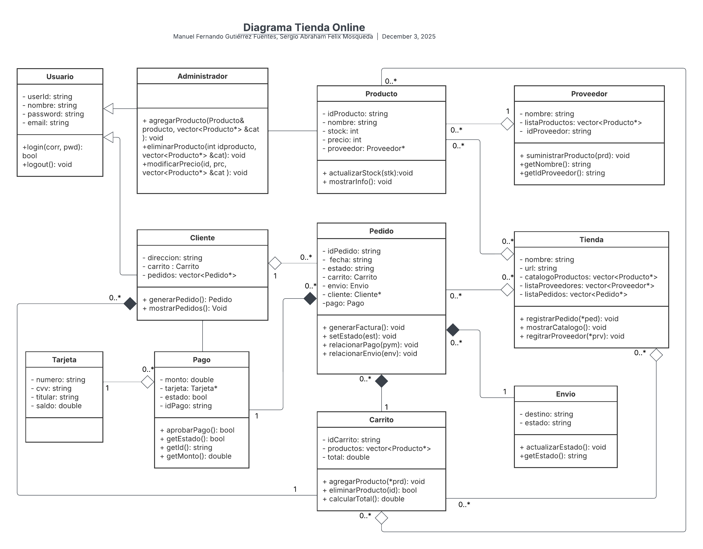

**Reto: Descripción de Clases y Métodos**

## **Clase: Usuario**

Representa la **entidad base de todos los actores que interactúan con el sistema** (clientes, administradores). Define los **atributos y comportamientos comunes** que caracterizan a cualquier persona o cuenta registrada dentro de la tienda online.  
Atributos:

- UserId (string): Identificador único del usuario dentro del sistema.  
- nombre (string): Nombre del usuario.  
- email (string): Correo electrónico, utilizado también como nombre de usuario para el inicio de sesión.  
- password (string): Contraseña validada para la autenticación.

Métodos: 

- Usuario(string id, string nom, string corr, string pass): Constructor. Inicializa un usuario con sus datos personales.  
- bool login(string email, string password)Verifica si las credenciales son correctas para permitir el acceso.  
- void logout(): Simula el cierre de sesión 

Relaciones:

- Herencia: Cliente, Administrador

## **Clase: Cliente – herencia de usuario**

Representa al **usuario que interactúa directamente con la tienda online** para explorar productos, agregarlos al carrito, realizar compras y gestionar sus pedidos. Hereda de la clase base Usuario, extendiendo sus funcionalidades con atributos y métodos específicos para el comportamiento de un comprador.  
Atributos: 

- direccion (string): Dirección física del cliente para el envío de productos.   
- carrito (Carrito): Contiene los productos que el cliente ha agregado para una compra potencial.  
- pedidos (vector\<Pedido\*\>): Guarda referencias a todos los pedidos realizados por el cliente.

Métodos: 

- Constructor: Cliente(string id, string nom, string corr, string pass, string dir): Inicializa un cliente con su información de contacto  
- bool generarPedido(Pago& pym): Intenta generar un pedido con base en el carrito actual y el pago asociado. Solo lo crea si el pago es aprobado.  
- void verHistorialPedidos() const: Muestra por consola todos los pedidos realizados por el cliente.

Relaciones:

- Agregación: Pedido (0:\*)  
- Composición: Carrito (1)  
- Asociación: Pago  
- Herencia: Usuario

## **Clase: Administrador – herencia de usuario**

Representa al **usuario con privilegios de gestión** dentro de la plataforma de comercio electrónico.  
Hereda de la clase base Usuario, extendiendo su comportamiento para administrar el **catálogo de productos**.   
Atributos:

- Heredados

Métodos:

- Constructor: Administrador(string id, string nom, string corr, string pass). Inicializa un administrador con credenciales y nivel de acceso definido.  
- void agregarProducto(Producto& prd, vector\<Producto\*\>& cat): Agrega un nuevo producto al catálogo de la tienda.  
- void eliminarProducto(int id, vector\<Producto\*\> \&cat): Elimina un producto existente del catálogo según su identificador.  
- void modificarPrecio(int id, double prc, vector\<Producto\*\>& cat): Actualiza el precio de un producto existente.

Relaciones:

- Asociación: Producto  
- Herencia: Usuario

## **Clase: Tienda**

Representa el **sistema central de la plataforma de comercio electrónico**, encargada de **gestionar la operación completa**:  
Mantener el catálogo de productos, registrar clientes y administradores y pedidos.   
Atributos: 

- nombre (string): Nombre de la tienda o marca.  
- url (string): URL o dirección digital del sitio de e-commerce.  
- catalogo (vector\<Producto\*\>): Contiene todos los productos disponibles en la tienda.  
- proveedores(vector\<Proveedor\*\>): Almacena los proveedores asociados a la tienda.  
- pedidos(vector\<Pedido\*\>): Contiene el historial de todos los pedidos realizados.

Métodos:

- Constructor: Tienda(string nom, string web): Inicializa la tienda con su identidad básica.  
- void registrarProveedor(Proveedor\* prv): Registra un proveedor vinculado a la tienda.  
- void registrarPedido(Pedido\* ped): Guarda un pedido dentro del historial de la tienda.  
- void mostrarCatalogo() const: Muestra en consola todos los productos disponibles. 

Relaciones:

- Agregacion: Proveedor(0:\*), Producto (0:\*), Pedido (0:\*)

## **Clase:  Proveedor**

Modela a las **entidades externas que abastecen de productos o servicios** a la tienda en línea.  
Cada proveedor puede ofrecer uno o varios productos, permitiendo mantener un flujo de abastecimiento constante y actualizado dentro del catálogo de la tienda.  
Atributos:

- nombre (string): Nombre comercial del proveedor  
- idProveedor (string): Identificador único del proveedor.  
- listaProductos (vector \<Producto\*\>): Contiene los productos que el proveedor ofrece a la tienda.

Métodos: 

- Constructor: Proveedor(string id, string nom): Inicializa un proveedor con sus datos básicos.  
- void agregarProducto(Producto\* prd): Registra un producto ofrecido por el proveedor.  
- string getNombre() const: Retorna el nombre del proveedor.  
- string getIdProveedor() const: Devuelve el identificador único del proveedor.

Relaciones:

- Agregación: Producto (0:\*), Tienda (0:\*)

## **Clase: Producto**

Representa el **elemento central del comercio electrónico**, es decir, los bienes o servicios que la tienda ofrece a los clientes.  
Cada producto cuenta con información clave como su **nombre, precio, descripción, stock y proveedor**, y puede formar parte del **catálogo**, del **carrito de compra** o de un **pedido**.  
Atributos:

- idProducto (string): Identificador único del producto.  
- nombre (string): Nombre comercial del producto.  
- descripcion (string): Una descripción del producto.  
- stock (int): Cantidad disponible en inventario.  
- precio (double): Precio unitario del producto.  
- proveedor (Proveedor\*): Referencia al proveedor que suministra el producto.

Métodos: 

- Constructor: Producto(string id, string nom, double pre, int stk, Proveedor\* prv): Inicializa el producto con todos sus datos principales y su proveedor asociado.  
- void actualizarStock(int cnt): Suma o resta unidades del stock (por ejemplo, tras una venta o reposición)  
- string getIdProducto() const: Devuelve el identificador único del producto.  
- string getNombre() const: Retorna el nombre del producto.  
- double getPrecio() const: Retorna el precio actual.  
- int getStock() const: Devuelve la cantidad disponible.  
- Proveedor\* getProveedor() const: Retorna el proveedor asociado al producto.  
- void mostrarInfo() const: Imprime los detalles principales del producto (nombre, precio, stock, proveedor).

Relaciones:

- Agregación: Proveedor(1), Tienda (0:\*), Carrito (0:\*)  
- Asociación: Administrador

## **Clase: Pedido**

Representa el **registro formal de una transacción de compra** dentro del sistema de comercio electrónico.  
Un pedido se genera a partir de un **carrito de compras** (que contiene los productos seleccionados por el cliente), y puede incluir información sobre el **cliente**, el **envío** y el **pago** asociado.  
Atributos:

- idPedido (string): Identificador único del pedido.  
- fecha (string): Fecha en la que se realizó el pedido.  
- estado: Estado actual del pedido (por ejemplo, “pendiente”, “pagado”, “enviado”, “entregado”).  
- carrito (Carrito): Carrito asociado que contiene los productos comprados  
- envio (Envio): Envío asociado al pedido.  
- cliente (Cliente\*): Referencia al cliente que realiza el pedido.  
- pago (Pago): pago realizado para este pedido.

Métodos:

- Constructor: Pedido(string id, string fch, Cliente\* clt, Carrito car): Inicializa un pedido con los datos básicos y el carrito asociado.  
- void asociarPago(Pago pmt): Vincula un pago al pedido.  
- void asociarEnvio(Envio env): Asocia la información de envío al pedido.  
- void setEstado(string est): Cambia el estado del pedido (por ejemplo, de “pendiente” a “pagado”).  
- string getEstado() const: Retorna el estado actual del pedido.  
- void generarFactura(): Muestra toda la información del pedido: productos, total, estado, cliente y pago.

Relaciones:

- Composicion: Carrito (1), Envio (1), Pago (1)  
- Agregación: Cliente (1), Tienda (0:\*)

## **Clase. Carrito**

Representa el **contenedor temporal de productos seleccionados por un cliente** antes de confirmar una compra.  
Su función principal es **permitir al cliente añadir, eliminar o visualizar productos**, así como **calcular el total** de su compra.  
Atributos:

- idCarrito (string): Identificador único del carrito.  
- productos (vector\<Producto\*\>): Lista de productos añadidos por el cliente.  
- total (double): Monto total acumulado del carrito.

Métodos:

- Constructor: Carrito(int id): Inicializa un carrito vacío con ID único.  
- void agregarProducto(Producto\* prd): Agrega un producto al vector de productos.  
- void eliminarProducto(int id): Busca y elimina un producto del carrito por su identificador.  
- double calcularTotal(): Suma los precios de todos los productos para actualizar el total.  
- vector\<Producto\*\> getProductos() const: Devuelve la lista de productos (para generar un pedido).

Relaciones:

- Agregacion: Producto (0:\*)

## **Clase: Envio**

Representa la **gestión del envío de un pedido** realizado por un cliente.  
Se encarga de almacenar y controlar la **información del destino, estado de envío, fecha estimada de entrega y empresa transportista** encargada de la distribución.  
Atributos: 

- destino (string): Dirección de destino del pedido.  
- estado (string): Estado actual del envío (“pendiente”, “en tránsito”, “entregado”).

Métodos:

- Constructor: Envio(string des): Inicializa los datos del envío asociado a un pedido.  
- void actualizarEstado(string est): Cambia el estado actual del envío (por ejemplo, de “pendiente” a “en tránsito”).  
- string getEstado() const: Retorna el estado actual del envío.

## **Clase: Pago**

Representa el proceso de **gestión y validación del pago de un pedido** dentro del sistema de tienda en línea.  
Su responsabilidad es manejar la información relacionada con el método de pago, el monto total a pagar, y validar que la transacción sea aprobada antes de generar el pedido.  
Atributos:

- idPago (string): Identificador único del pago.  
- monto (double): Total a pagar.  
- tarjeta (Tarjeta\*): Puntero al objeto Tarjeta utilizado para realizar el pago.  
- estado (bool): Indica si el pago fue aprobado (true) o rechazado (false).

Métodos:

- Constructor: Pago(string id, double mon, Tarjeta\* trj): Crea un pago inicializando los datos esenciales de la transacción.  
- bool aprobarPago(): Simula o valida la aprobación del pago según el saldo disponible en la tarjeta.  
- bool getEstado() const: Devuelve si el pago fue aprobado o rechazado.  
- double getMonto() const: Devuelve el monto total del pago.

Relaciones:

- Agregación: Tarjeta (1)  
- Asociación: Cliente

## **Clase: Tarjeta**

Representa la **tarjeta de crédito o débito** asociada a un cliente.  
Su función principal es **almacenar la información de pago** (como el número de tarjeta, titular)  
Atributos: 

- numeroTarjeta (string): Número único de la tarjeta.  
- titular (string): Nombre del propietario de la tarjeta.  
- cvv (string): Código de seguridad de la tarjeta.  
- saldo (double): Monto disponible 

Métodos

- Constructor: Tarjeta(string num, string tit, string cvv, double mon): Crea un objeto tarjeta con la información básica y saldo inicia.  
- void modificarSaldo(double sal): Cambio el valor restante del saldo incial  
- void mostrarInfoTarjeta() const: Muestra los datos esenciales de la tarjeta (sin revelar el CVV por seguridad).  
- double mostrarSaldo() const: Muestra el saldo restante de la tarjeta

Relaciones:

- Agregación: Pago (0:\*)